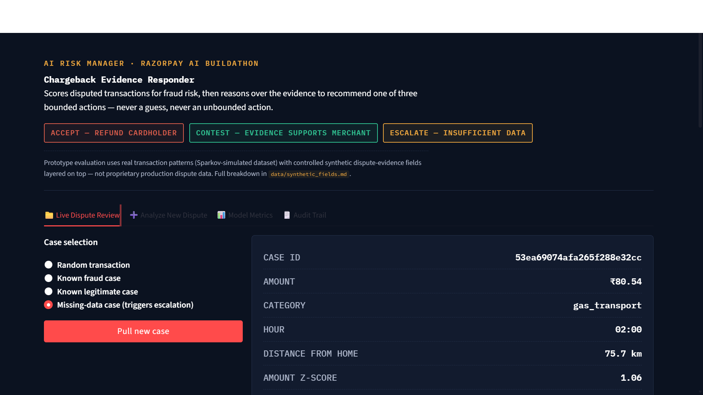
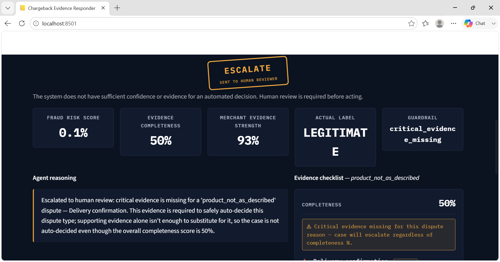
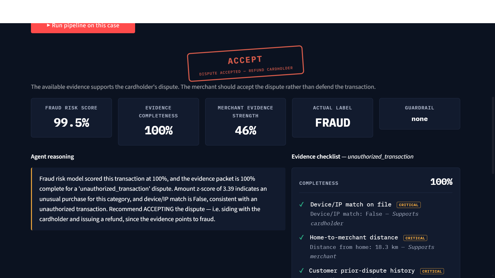
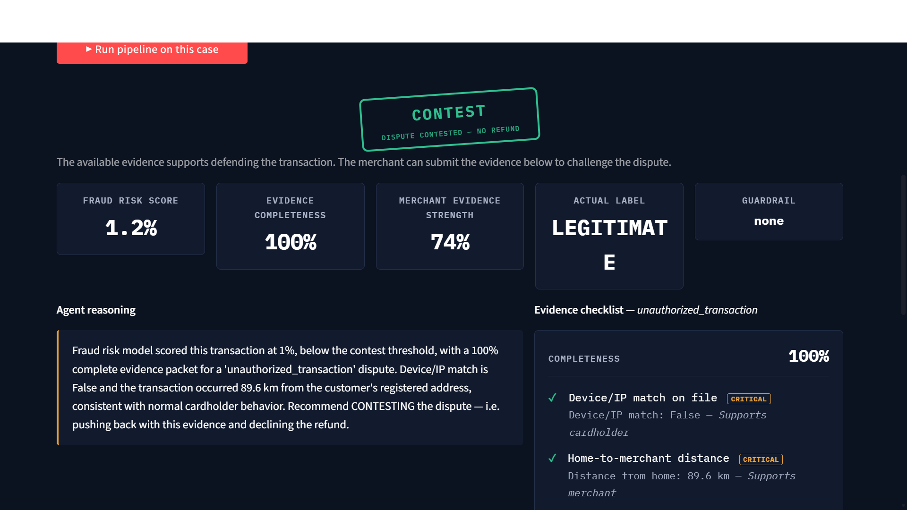
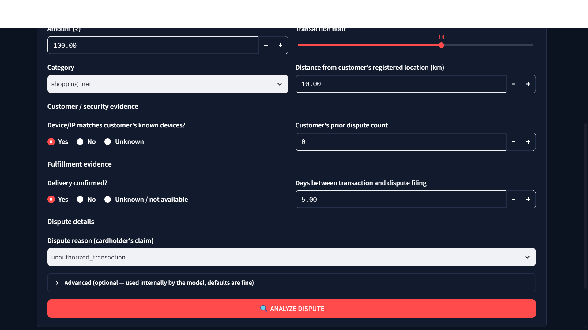

# Chargeback Evidence Responder

**Track:** AI Risk Manager — Razorpay AI Buildathon

> A merchant-side chargeback investigation system: an ML model assesses fraud risk, an evidence engine checks whether the evidence needed to defend or accept a dispute actually exists, deterministic guardrails decide what can be automated, and every decision is logged for audit — with a human reviewer brought in whenever the evidence isn't good enough to trust to a machine.

---

## The problem

When a cardholder disputes a transaction, a merchant has to decide fast: **accept the dispute and refund**, or **contest it with evidence**. Getting this wrong is expensive both ways — refunding real fraud is a loss, but contesting a real fraud claim (or contesting without solid evidence) damages the merchant's standing with the payment processor. Today this is a manual, inconsistent, slow judgment call. This system automates the safe cases and explicitly refuses to automate the unsafe ones.

---

## Try it yourself — this isn't limited to canned examples

The app has two ways to test it, both running through the **exact same trained classifier and evidence engine**:

- **Live Dispute Review** — pull real transactions from the dataset (known fraud, known legitimate, or a case engineered to hit the critical-evidence-missing guardrail) to see the system reason over ground-truth cases.
- **Analyze New Dispute** — a form where you enter **your own custom dispute scenario** from scratch (amount, category, device match, delivery status, dispute reason, etc.) and get a live decision. Nothing is pre-scripted here — the model infers risk from whatever you provide; it is never told the answer. You can also tweak a single input on an already-analyzed case and re-run instantly via **"What changed the decision?"** to watch the recommendation respond to evidence in real time.

This means a reviewer isn't limited to the demo cases we picked — you can construct any scenario you want and the system will reason over it live.



---

## Architecture

```
                        NEW DISPUTE
                             │
                             ▼
                ┌─────────────────────────┐
                │ Transaction + Dispute    │
                │ Evidence                 │
                └────────────┬─────────────┘
                             │
              ┌──────────────┴───────────────┐
              ▼                               ▼
      ┌───────────────┐             ┌──────────────────────┐
      │   ML MODEL     │             │   EVIDENCE ENGINE     │
      │ Random Forest  │             │ • Completeness score  │
      │ Fraud risk %   │             │ • Merchant strength   │
      │               │             │ • Critical-gap check   │
      └───────┬────────┘             └───────────┬───────────┘
              │                                   │
              └───────────────┬───────────────────┘
                              ▼
                      ┌───────────────┐
                      │ POLICY GATE   │
                      │ (deterministic│
                      │  guardrails)  │
                      └───────┬───────┘
                              │
              ┌───────────────┼───────────────┐
              ▼               ▼               ▼
      ACCEPT DISPUTE      ESCALATE      CONTEST DISPUTE
      (refund cardholder) (human review) (defend, no refund)
              │               │               │
              └───────────────┼───────────────┘
                              ▼
                      ┌───────────────┐
                      │ EVIDENCE AGENT │
                      │ (LLM, bounded) │
                      └───────┬───────┘
                              ▼
                        EXPLANATION
                              │
                              ▼
                        AUDIT TRAIL
```

**The LLM never decides the money action.** It only explains a decision the deterministic policy gate has already made, citing the evidence it was given — it cannot propose an action outside `{ACCEPT, CONTEST, ESCALATE}`, and any malformed output is forced to `ESCALATE` rather than trusted.

---

## How it works, step by step

1. **ML model** scores the transaction's fraud probability (Random Forest, trained on real transaction data).
2. **Evidence engine** looks up what evidence a dispute of *this specific reason* requires (delivery confirmation matters for "product not received"; it doesn't matter for "duplicate charge"), checks what's actually available, and computes two independent scores:
   - **Completeness** — how much of the required evidence exists at all
   - **Merchant evidence strength** — of the evidence that *does* exist, how strongly does it support the merchant's side (contesting) vs. the cardholder's (refunding)
3. **Policy gate** applies deterministic rules: if any evidence marked **critical** for this dispute reason is missing, the case escalates to a human — no matter how confident the fraud model is. Missing only *supporting* evidence doesn't force escalation; it's reflected honestly in the completeness score instead.
4. **Evidence agent** (LLM, falls back to rule-based logic with no API key) explains the decision the policy gate already made, citing specific evidence values — it cannot invent evidence or override the gate.
5. **Audit trail** logs every decision: inputs, fraud score, completeness, strength, critical gaps, final action, and reasoning — fully reconstructable after the fact.

---

## Critical vs. supporting evidence

This is the core design decision that makes the system trustworthy rather than just automated. Evidence is split per dispute reason:

| Dispute reason | Critical (missing → always escalate) | Supporting (missing → lowers completeness, doesn't force escalation) |
|---|---|---|
| Unauthorized transaction | Device/IP match, location consistency, transaction history | Delivery confirmation, dispute timing |
| Product not received | Delivery confirmation | Dispute timing |
| Product not as described | Delivery confirmation | Spend-pattern consistency |
| Duplicate charge | Transaction history | Dispute timing |
| Credit not processed | Transaction history | Dispute timing |

A dispute missing *only* supporting evidence still gets auto-decided — a thin-but-not-critical gap shouldn't block automation any more than it should be ignored. A dispute missing *critical* evidence always escalates, regardless of how confident the fraud model is. This mirrors how a real reviewer would actually behave, rather than using one blanket "% complete" threshold for every situation.

**In practice:** below, the fraud model is nearly certain the transaction is legitimate (0.1% risk) and the evidence that *is* present strongly favors the merchant (93% strength) — but the case still escalates, because critical evidence for this dispute reason is missing. Neither the risk score nor the strength score can override that.



---

## Data

Built on the **Sparkov Credit Card Transactions Fraud Detection** dataset (Kaggle: `kartik2112/fraud-detection`) — 150,000 real transaction rows, 0.92% fraud rate, spanning January–March 2019.

The source dataset has no dispute-operations metadata (delivery status, device/IP match, dispute reason codes) — real chargeback systems have this, but a public fraud dataset wasn't built to include it. These fields are layered on as clearly-flagged synthetic fields (`synth_*`), probabilistically correlated with the real fraud label but with deliberate noise — not a 1:1 giveaway. **Full documentation of every real vs. synthetic field is in [`data/synthetic_fields.md`](data/synthetic_fields.md).**

This is a controlled prototype evaluation, not validation on proprietary production dispute data.

---

## Results (held-out test set)

| Model | Precision | Recall | F1 | ROC-AUC |
|---|---|---|---|---|
| Logistic Regression | 0.19 | 0.94 | 0.32 | 0.992 |
| **Random Forest (final model)** | **0.73** | **0.92** | **0.82** | **0.998** |

**Business impact on this test set:**
- False-positive cost: legitimate transactions wrongly flagged, ~₹1,700
- Fraud missed cost: fraud that slipped through, ~₹13,500
- **Net value: ~₹143,000** saved vs. taking no action

### Honesty check: is the model just leaning on synthetic data?

We also trained the identical architecture using **only real, non-synthetic features** — no dispute-context fields at all. Result: **F1 = 0.51, recall = 88%**. The model still catches the large majority of fraud from genuine transaction signal alone (spend-pattern deviation, timing, distance). The synthetic dispute-context fields lift F1 to 0.82 mainly by cutting false positives — the kind of operational context a real payments platform would have on top of raw transaction data, not a shortcut around learning real fraud patterns. Both runs are in [`evaluation/metrics_report.json`](evaluation/metrics_report.json).

---

## What the app does

**Live Dispute Review** — pull a real transaction from the dataset (random, known-fraud, known-legitimate, or a case engineered to hit the critical-evidence-missing guardrail) and watch the full pipeline run.





**Analyze New Dispute** — enter a dispute manually. The model infers risk from what you provide; it's never told the answer. Runs through the exact same trained classifier and evidence engine as the sample cases — no separate or simplified scoring path. Includes a **"What changed the decision?"** panel: tweak one piece of evidence (device match, delivery, amount) and re-run instantly to see the decision respond to evidence in real time.



**Model Metrics** — precision/recall/F1/ROC-AUC, confusion matrix, net business value, and the real-vs-synthetic honesty comparison.

**Audit Trail** — every decision ever made in the app session, fully expandable, with completeness/strength/critical-gap status surfaced at the top level.

Every decision also shows a **Key Evidence Signals** panel — the model's real, globally-trained feature importances applied to this case's actual values, explicitly labeled as global importance + threshold heuristics rather than fabricated per-instance attribution (no SHAP is used, and none is claimed).

---

## Failure case, handled explicitly

Roughly 3% of transactions have missing delivery-confirmation data, simulating a real operational gap. For dispute reasons where delivery confirmation is **critical** (e.g. "product not received"), the system does not guess — the policy gate forces `ESCALATE` before the evidence agent's reasoning step ever runs, and logs exactly why. Demoed live via the "Missing-data case" sample option.

---

## Running it

```bash
pip install -r requirements.txt
# place fraudTrain.csv (or a large sample) in data/raw/
python src/model.py              # trains classifier, writes metrics_report.json
export ANTHROPIC_API_KEY=...     # optional — enables LLM-powered reasoning;
                                  # falls back to transparent rule-based
                                  # reasoning automatically if unset
streamlit run app/streamlit_app.py
```

---

## Project structure

```
chargeback-evidence-responder/
├── data/
│   ├── raw/                    # source transaction data
│   ├── processed/              # feature-engineered output
│   └── synthetic_fields.md     # real vs. synthetic field documentation
├── src/
│   ├── features.py             # feature engineering (real + synthetic)
│   ├── model.py                # classifier training + evaluation
│   ├── evidence_checklist.py   # critical/supporting evidence per dispute reason
│   ├── guardrails.py           # bounded actions + escalation policy gate
│   ├── evidence_agent.py       # LLM / rule-based reasoning layer
│   ├── audit_log.py            # decision logging
│   └── run_pipeline.py         # end-to-end batch runner
├── models/classifier.pkl
├── evaluation/metrics_report.json
├── logs/audit_trail.jsonl
└── app/streamlit_app.py        # live demo (sample cases + manual entry)
```

---

## Scope boundaries

Strictly defense-only, as required by the track: this system detects and responds to disputes — it has no capability to initiate transactions, generate fraudulent evidence, or take any action outside the three bounded outcomes above. The LLM layer is explanatory only and cannot alter the policy gate's decision.
